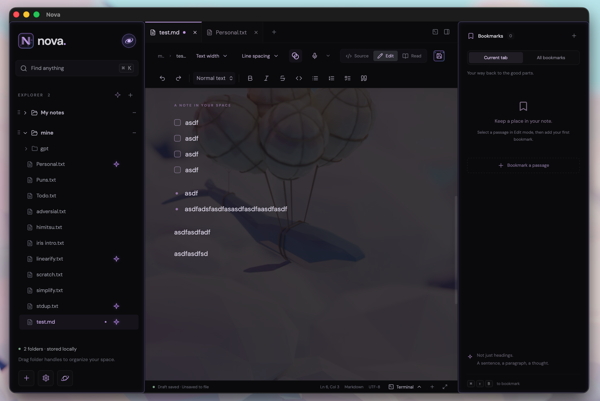
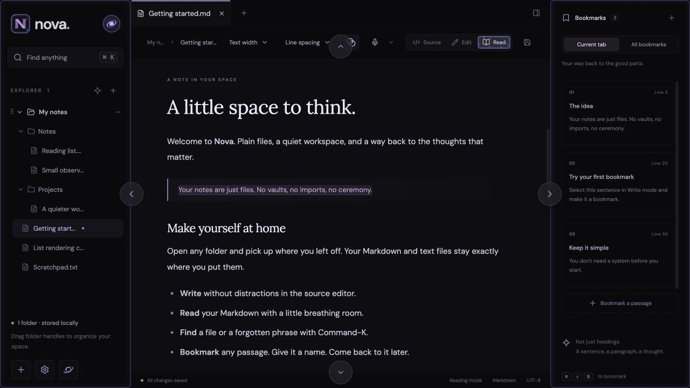
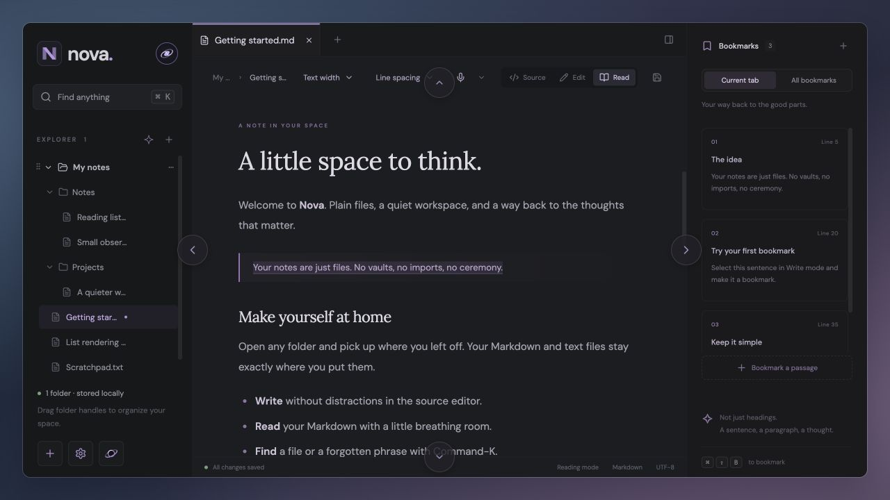
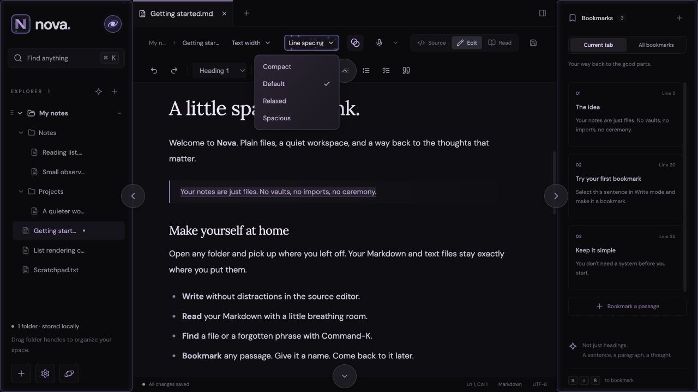
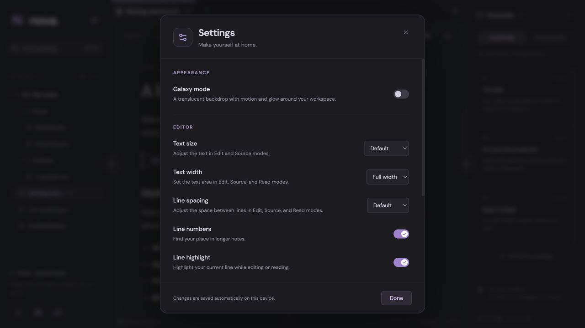
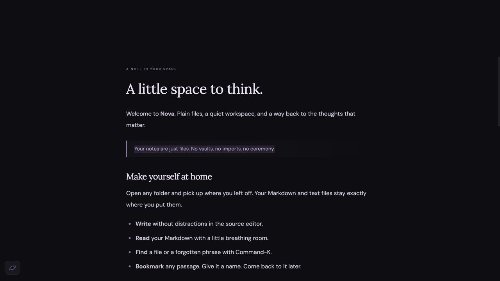

# Nova

### A little space to think.

Nova is a notes app for Mac and Windows that gives your words room to breathe. Write, collect ideas, and return to the passages that matter—all in ordinary text and Markdown files on your computer.

**[Download Nova](#download-nova)** · **[Take a look](#make-yourself-at-home)** · **[Get started](#your-first-few-minutes)**

*Your files on the left. Your thoughts in the middle. Your favorite passages on the right.*

- **Keep your notes yours.** Open folders you already use. Your notes remain files you can open in other apps.
- **Find your way back.** Search for a filename or a phrase, star a favorite note, or give an important passage its own bookmark.
- **Settle into writing.** Adjust the text size, spacing, and layout, or hide the panels and focus on the page.
- **Speak a thought.** Voice typing turns English speech into text on your computer, after a one-time download.

## Download Nova

Choose the download for your computer:

| Your computer | Download |
| --- | --- |
| Mac with an Apple M-series chip | [Download for Mac — Apple Silicon](https://github.com/Sthakur27/Nova/releases/latest/download/Nova-mac-apple-silicon.dmg) |
| Mac with an Intel processor | [Download for Mac — Intel](https://github.com/Sthakur27/Nova/releases/latest/download/Nova-mac-intel.dmg) |
| Windows PC with an Intel or AMD 64-bit processor | [Download for Windows](https://github.com/Sthakur27/Nova/releases/latest/download/Nova-windows-x64.exe) |

On **Mac**, open the downloaded file and drag Nova into Applications. On **Windows**, open the installer and follow the steps. You don't need a GitHub account or developer tools.

Not sure which Mac you have? Open **Apple menu → About This Mac** and look for **Chip** or **Processor**.

**Nova is an early preview.** The installers aren't digitally signed yet, so your computer may display a security warning. See [all releases and release notes](https://github.com/Sthakur27/Nova/releases/latest) for available builds. Download links become available after the first successful release.

## Make yourself at home

### A little glow, or a quieter view

Turn **Galaxy mode** on for translucent surfaces and glowing edges, or off for a simple, solid background. Your notes and bookmarks stay right where they are.

Let a little of your background show through the page with **Translucent background**, the overlapping-circles button above your note. You can turn it off while keeping Galaxy's glow.

| Galaxy on | Galaxy off |
| :---: | :---: |
|  |  |

### Comfortable controls, close at hand

Give a long paragraph more breathing room with **Line spacing**, or choose a comfortable reading width with **Text width**. Both controls are right above your note. Drag the side-panel dividers to resize them, and use the arrows around the edges to tuck panels away.

Open **Terminal** from the icon above your note or the control in the status bar to run a shell below your note in the desktop app. Use **+** for another terminal tab, resize the tray by dragging its top edge or empty tab-bar area, and collapse it without stopping your shells. See the [terminal guide](docs/user-guide.md#terminal) for session controls and shortcuts.

Open **Settings** using the gear in the lower-left corner to adjust text size, spacing, and other reading and writing preferences. Nova remembers your choices on this computer.

### Just you and the page

Enter **focus mode** to hide the folders, bookmarks, and toolbars. Choose your preferred text width first, then settle into the page. Press **⌘ G** on Mac or **Ctrl G** on Windows to bring all the panels back.

*The opening showcase shows the desktop app. The other screenshots show sample notes in the browser preview. The Galaxy comparison uses a soft blue-purple backdrop to show the editor's translucency. Open your own folders and use voice typing in the desktop app.*

## Your first few minutes

1. **Open a folder.** Click **Add folders** and choose where you keep your notes. You can add more than one.
2. **Start a note.** Open a file from the sidebar, or click **+** beside the tabs to create one. New notes start as plain text; choose `.md` as the default file extension in Settings if you want headings, lists, and other formatting.
3. **Choose your view.** For Markdown notes, **Edit** lets you write with formatting, **Read** gives you a reading view, and **Source** shows the underlying text.
4. **Mark a good passage.** Select some text and use **Add bookmark** in the bookmarks panel. Give it a name so you can find it again.
5. **Save your work.** Press **⌘ S** on Mac or **Ctrl S** on Windows to save changes to the original file. Nova also keeps recovery drafts on this computer as you work.

### A few handy shortcuts

Use **⌘ + arrow keys** on Mac or **Ctrl + arrow keys** on Windows to toggle panels: **← navigation**, **→ bookmarks**, **↑ top bars**, and **↓ terminal**. These shortcuts also work while editing a note or using the terminal; adding Shift keeps the normal text-selection shortcut.

| What you'd like to do | Mac | Windows |
| --- | --- | --- |
| Find a note, bookmark, or phrase | ⌘ K | Ctrl K |
| Find within the current note | ⌘ F | Ctrl F |
| Create a note | ⌘ T | Ctrl T |
| Bookmark a passage | ⌘ Shift B | Ctrl Shift B |
| Save | ⌘ S | Ctrl S |
| Start / stop dictation | ⌘ V | Click Dictate |
| Enter or leave focus mode | ⌘ G | Ctrl G |
| Open Settings | ⌘ , | Ctrl , |
| Zoom in / out | ⌘ + / − | Ctrl + / − |

### Prefer to say it?

Click **Dictate**, the microphone above your note. On first use, Nova asks you to download its English speech model (about 78 MB). Place your cursor and start recording: words appear with a short processing delay and may be revised as you speak. Stop to finalize them. Recordings can be up to two minutes long. On Mac, **⌘ V** starts or stops dictation; this replaces the usual Paste shortcut in Nova.

Your audio stays on your computer and isn't uploaded. Voice typing requires the desktop app and microphone access. See the [voice typing guide](docs/user-guide.md#voice-typing) for details.

## A few things to know

Nova is still a prototype. Alongside plain text and Markdown notes, it offers basic code editing for Python, TypeScript/JavaScript (including JSX/TSX), Java, JSON, HTML, and CSS. Open a file with the corresponding extension to get syntax highlighting, completion suggestions, basic syntax diagnostics, bracket matching, indentation, and folding. See [code editing](docs/user-guide.md#code-editing) for shortcuts and limits. Image attachments and sync between devices aren't available yet. If you change files in another app, refresh the folder and reopen the note to pick up the changes.

Recovery drafts help you return to unfinished work, but **Save** writes changes to your original files. Keep a separate backup of important notes. If a file changes outside Nova while you're editing, Nova stops the save so you can reconcile the two versions.

## Explore further

- **[Reference guide](docs/user-guide.md)** — detailed controls, bookmarks, tabs, saving, and current limits.
- **[Developer guide](docs/development.md)** — run from source, build installers, and run checks.
- **[Release notes](https://github.com/Sthakur27/Nova/releases/latest)** — available downloads and changes.
