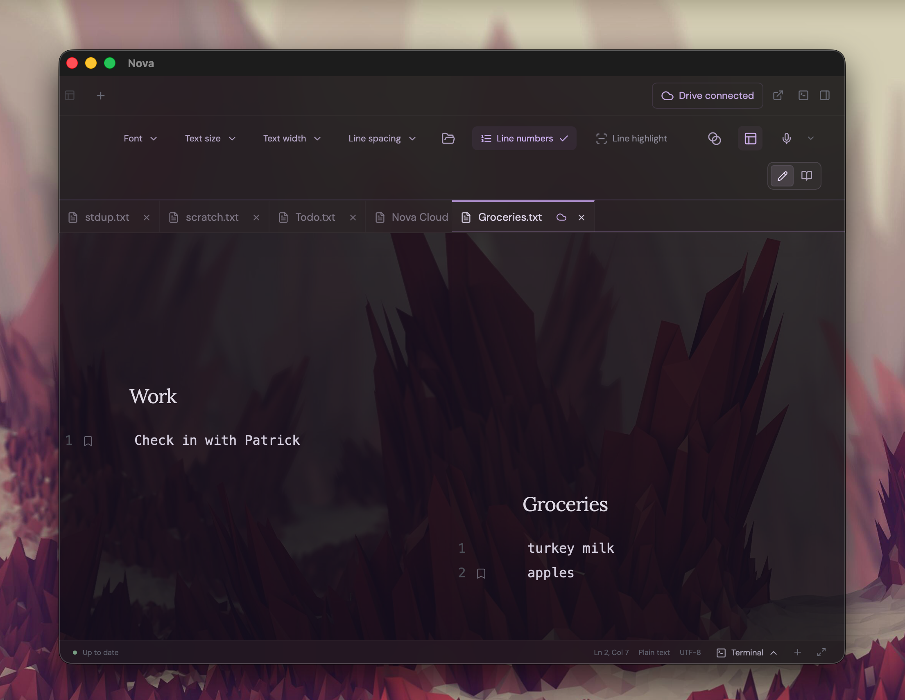
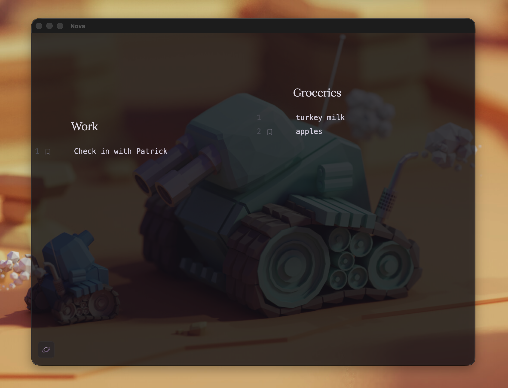
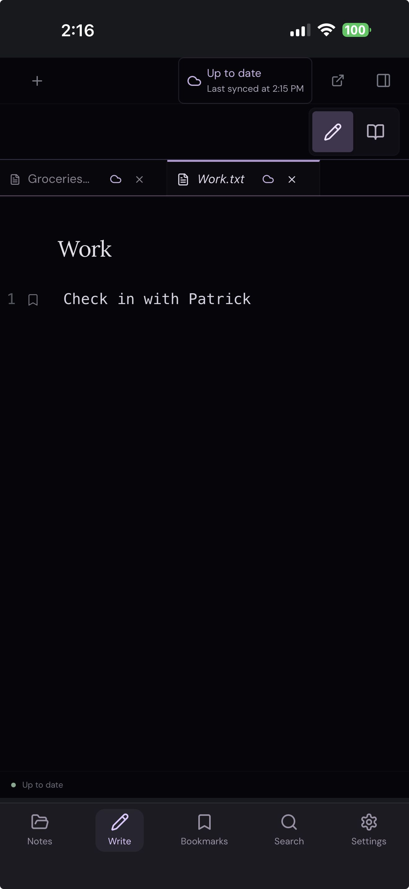

# Nova

### A little space to think.

Nova is a notes app for Mac and Windows that gives your words room to breathe. Write, collect ideas, and return to the passages that matter—all in ordinary text and Markdown files on your computer.

**[Download Nova](#download-nova)** · **[Take a look](#make-yourself-at-home)** · **[Get started](#your-first-few-minutes)** · **[What’s new](CHANGELOG.md)**


*Your files on the left. Your thoughts in the middle. Your favorite passages on the right.*

- **Keep your notes yours.** Open folders you already use. Your notes remain files you can open in other apps.
- **Find your way back.** Search for a filename or a phrase, star a favorite note, or give an important passage its own bookmark.
- **Take your notes with you.** Connect Google Drive for autosaving Cloud spaces and offline editing.
- **Settle into writing.** Adjust the text size, spacing, and layout, or hide the panels and focus on the page.
- **Speak a thought.** Voice typing turns English speech into text on your computer, after a one-time download.

## Download Nova

Choose the download for your computer:

| Your computer | Download |
| --- | --- |
| Mac with an Apple M-series chip | [Download for Mac — Apple Silicon](https://github.com/Sthakur27/Nova/releases/latest/download/Nova-mac-apple-silicon.dmg) |
| Mac with an Intel processor | [Download for Mac — Intel](https://github.com/Sthakur27/Nova/releases/latest/download/Nova-mac-intel.dmg) |
| Windows PC with an Intel or AMD 64-bit processor | [Download for Windows](https://github.com/Sthakur27/Nova/releases/latest/download/Nova-windows-x64.exe) |

Nova is free to download and use. You don't need a GitHub account or developer tools.

**Mac installation**

1. Open the downloaded DMG and drag **Nova** into **Applications**.
2. Open Nova from Applications. If macOS blocks it, open **System Settings → Privacy & Security** and click **Open Anyway** if available, then confirm.
3. If you see **“Nova is damaged”** or cannot open it that way, click **Cancel**, open **Terminal** (search for it with **⌘ Space**), paste this command, and press Return:

   ```sh
   xattr -dr com.apple.quarantine "/Applications/Nova.app"
   ```

   Open Nova from Applications again. Only use this command for a copy from this project's official downloads. It removes the download restriction for Nova alone; no administrator password is needed for a copy you own. A new download may need this step again.

Nova's Mac builds use free ad-hoc signing, but aren't Apple-notarized, so macOS may require this extra approval.

Not sure which Mac you have? Open **Apple menu → About This Mac**: choose Apple Silicon for an Apple M-series **Chip**, or Intel for an Intel **Processor**.

**Windows installation:** open the EXE and follow the installer steps. These preview builds aren't publisher-signed, so Windows may display a security warning.

See [all releases and release notes](https://github.com/Sthakur27/Nova/releases/latest) for available builds.

## Make yourself at home

### A workspace for each folder

Open a folder you already use and give it its own window. **Recent** brings you back to its tabs and recovery drafts, while opening another folder leaves your current work in place. Folders load as you expand them, so you can start browsing without waiting for the whole tree to scan.

### Find a note, or the thought inside it

Press **⌘ P** on Mac or **Ctrl P** on Windows to find a file by name. Use **⌘ K / Ctrl K** to search filenames, saved text, and bookmarks, or choose **Settings** to find and adjust a preference.

Search the current note, including unsaved edits, or the local folder and Cloud spaces in this window. Narrow results with case-sensitive, whole-word, or regular-expression matching. **Advanced search** lets you include `*.md` or exclude `archive/**`; Nova remembers these search options for the workspace. See the [search reference](docs/user-guide.md#search) for details.

Open **Search** beside Files, or press **Command-Shift-F / Ctrl-Shift-F**, to search saved files with results grouped by file. Expand the arrow beside Find to preview replacements across saved Local files, select the files to change, and apply them. Unsaved drafts and Cloud spaces are excluded. For long Markdown notes, the **Heading outline** button in the right panel lists headings and jumps to a section without changing your editing or reading mode.

### Keep your favorites close

Star a note from the bar above it, then choose the **star icon** in the Bookmarks panel to browse your favorite files. Switch to the **bookmark icon** for saved passages. Both views group Local and Cloud into sections you can collapse independently.

Single-click a starred file to preview it; double-click to keep its tab open. Passage bookmarks take you straight back to the words you saved.

### Local files and Cloud spaces

Connect **Google Drive** from the cloud button beside Settings to discover your Cloud spaces. Cloud notes autosave on your device, sync while Nova is active, and stay editable offline. Your Local files stay local unless you choose **Move to Cloud…**.

Sync is available in configured Mac and Windows builds. Conflicting edits pause for review. If a file disappears from Drive, Nova keeps its local copy and offers **Restore to Cloud** or **Acknowledge & delete…** in Cloud settings. Deleting a Cloud note in Nova removes only this device’s copy. See the [Google Drive guide](docs/sync.md) for setup and recovery details.

### Two notes, room for both

Keep two notes open side by side, with your desktop showing through the translucent writing surface. A work reminder and an everyday list can share the same space.



### A little glow, or a quieter view

Turn **Galaxy mode** on for translucent surfaces and glowing edges, or off for a simple, solid background. Your notes and bookmarks stay right where they are.

With Galaxy mode enabled, the overlapping-circles **Background** button changes the page background. On Mac, choose Translucent, Black, or Frosted, and use **Frosted panels** to blur the surrounding panels independently. Windows offers Translucent or Black; Frosted is unavailable.

In Settings, choose **High performance** for smoother Galaxy animation or **Saver** for fewer animation frames and effects that settle when you pause.

| Galaxy on | Galaxy off |
| :---: | :---: |
|  |  |

### Comfortable controls, close at hand

Give a long paragraph more breathing room with **Line spacing**, or choose a comfortable reading width with **Text width**. Find these controls, along with **Font** and **Text size**, in the **View** menu above your note. In Read mode, choose **Continuous** scrolling or **Pages** with **Reading layout**. Drag the side-panel dividers to resize them, and use the arrows around the edges to tuck panels away.


Open **Terminal** from the icon above your note or the control in the status bar to run a shell below your note in the desktop app. Use **+** for another terminal tab, resize the tray by dragging its top edge or empty tab-bar area, and collapse it without stopping your shells. See the [terminal guide](docs/user-guide.md#terminal) for session controls and shortcuts.

Open **Settings** using the gear in the lower-left corner to adjust text size, spacing, and other reading and writing preferences. Nova remembers your choices on this computer. You can also hide tooltips in Settings for a quieter workspace.


### Just you and the page

Enter **focus mode** to hide the folders, bookmarks, and toolbars. Choose your preferred text width first, then settle into the page. Press **⌘ G** on Mac or **Ctrl G** on Windows to bring all the panels back.



*The opening showcase, side-by-side notes, and focus view show the desktop app. The other screenshots show sample notes in the browser preview. The Galaxy comparison uses a soft blue-purple backdrop to show the editor's translucency. Open your own folders and use voice typing in the desktop app.*

## A little space, wherever you go

Nova for **iPhone and iPad is in development**. The same quiet writing space is taking shape on mobile, with touch-friendly controls, offline copies of your Cloud notes, and Google Drive sync to carry your words between devices.

<p align="center">
  
</p>

*An early look at Nova on iPhone. Mobile is a development preview; a public release is still ahead. Follow the [mobile development guide](docs/mobile.md) for progress and setup.*

## Your first few minutes

1. **Open a folder.** Click **Open Folder** and choose where you keep your notes. Each window focuses one local folder. Opening another folder creates a new window; **Recent** reopens a folder with its saved tabs and drafts.
2. **Start a note.** Open a file from the sidebar, or click **+** beside the tabs or at the bottom-left of navigation to create one. New installations default to Markdown (`.md`) for headings, lists, and formatting. Choose another default file extension in Settings; existing preferences are preserved.
3. **Choose your view.** For Markdown notes, **Edit** lets you write with formatting, **Read** gives you a reading view, and **Source** shows the underlying text. In Edit, type `-` + Space for bullets or `1` + Space for numbering; [Markdown typing shortcuts](docs/user-guide.md#workspace-and-formatting) also cover headings, tasks, quotes, and inline formatting. Use **Code block** in the toolbar for multiline code, or type three backticks and Enter.
4. **Mark a good passage.** Select some text and use **Add bookmark** in the bookmarks panel. Give it a name so you can find it again.
5. **Save your work.** For Local notes, press **⌘ S** on Mac or **Ctrl S** on Windows to write changes to the original file. Cloud notes autosave. Nova also keeps recovery drafts on this computer as you work.

Show dotfiles and dotfolders with the hover eye button beside Local’s Recent and Open Folder controls, Settings, or **Show hidden files and folders** in Cmd/Ctrl-K settings. Open a workspace’s `.nova` file there in a normal editor tab with JSON validation, explicit saves, and recovery drafts. Cmd/Ctrl-K’s **Advanced search → Include hidden files and folders** separately controls search results. See the [reference guide](docs/user-guide.md#workspace-metadata).

### A few handy shortcuts

Use **⌘ + arrow keys** on Mac or **Ctrl + arrow keys** on Windows to toggle panels: **← navigation**, **→ bookmarks**, **↑ top bars**, and **↓ terminal**. These shortcuts also work while editing a note or using the terminal; adding Shift keeps the normal text-selection shortcut.

| What you'd like to do | Mac | Windows |
| --- | --- | --- |
| Find a file by name | ⌘ P | Ctrl P |
| Find a note, bookmark, phrase, or setting | ⌘ K | Ctrl K |
| Open / close find within the current note | ⌘ F | Ctrl F |
| Create a note | ⌘ T | Ctrl T |
| Close the current tab | ⌘ W | Ctrl W |
| Bookmark a passage | ⌘ Shift B | Ctrl Shift B |
| Save | ⌘ S | Ctrl S |
| Start / stop dictation | ⌘ Shift D | Click Dictate |
| Enter or leave focus mode | ⌘ G | Ctrl G |
| Open Settings | ⌘ , | Ctrl , |
| Zoom in / out | ⌘ + / − | Ctrl + / − |

### Prefer to say it?

Click **Dictate**, the microphone above your note. On first use, Nova asks you to download its English speech model (about 78 MB). Place your cursor and start recording: words appear with a short processing delay and may be revised as you speak. Stop to finalize them. Recordings can be up to two minutes long. On Mac, **⌘ Shift D** starts or stops dictation.

Your audio stays on your computer and isn't uploaded. Voice typing requires the desktop app and microphone access. See the [voice typing guide](docs/user-guide.md#voice-typing) for details.

## A few things to know

Nova is still a prototype. Alongside plain text and Markdown notes, it offers basic code editing for Python, TypeScript/JavaScript (including JSX/TSX), Java, JSON, HTML, and CSS. Open a file with the corresponding extension to get syntax highlighting, completion suggestions, basic syntax diagnostics, bracket matching, indentation, and folding. See [code editing](docs/user-guide.md#code-editing) for shortcuts and limits. Image attachments are not available yet. On desktop, native filesystem notifications detect external changes to open Local files and expanded folders, with another check when you return to the app. Clean notes reload automatically; unsaved edits and deleted open copies are retained with a notice.

Recovery drafts help you return to unfinished work; for Local notes, **Save** writes changes to your original files. Keep a separate backup of important notes. If a file changes outside Nova while you're editing, Nova stops the save so you can reconcile the two versions.

## Explore further

- **[Reference guide](docs/user-guide.md)** — detailed controls, bookmarks, tabs, saving, and current limits.
- **[Google Drive](docs/sync.md)** — connect, use Local and Cloud spaces, and understand autosave and current limits.
- **[iPhone and iPad](docs/mobile.md)** — native development setup, mobile storage, and sync verification.
- **[Developer guide](docs/development.md)** — run from source, build installers, and run checks.
- **[Changelog](CHANGELOG.md)** — a curated history of features, behavior changes, and fixes.
- **[Release notes](https://github.com/Sthakur27/Nova/releases/latest)** — available downloads and changes.

## App updates

On desktop, the **book icon** in the Settings header opens this guide on GitHub in your default browser. **Settings → About Nova → Open README** offers the same link, whether or not an update is available.

Nova checks for updates shortly after launch and whenever Settings opens. A top-left update icon opens Settings when an update is available. An **Update Nova** button appears in Settings only when an update is available. Click it to download, then choose **Restart to update** when ready. Downloads do not interrupt writing.

Before installation, Nova preserves the current session and recovery draft. Finish voice typing and close other Nova windows first; terminal sessions end on restart. Existing installations without this feature need one manual installation of an updater-enabled release.

Release maintainers: see [the updater release guide](docs/app-updates.md).
